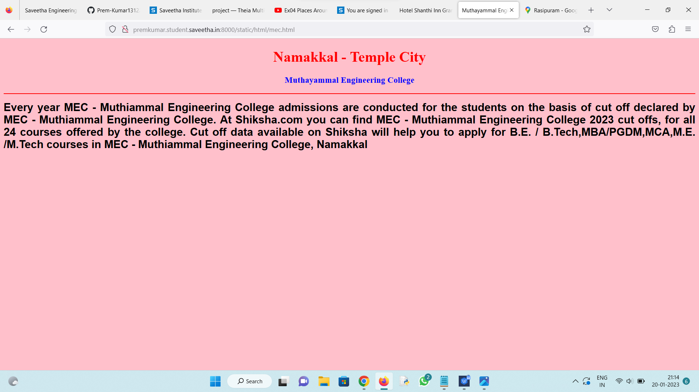

# Places Around Me
## AIM:
To develop a website to display details about the places around my house.

## Design Steps:

### Step 1:
Clone the github repository and create a django admin interface

### Step 2:
write programs for clickable regions in map

## Code:
```
map.html
<!DOCTYPE html>
<html lang="en">
<head>
<title>My City</title>
</head>
<body>
<h1 align="center">
<font color="red"><b>Namakkal - Temple City</b></font>
</h1>
<h3 align="center">
<font color="blue"><b>Prem Kumar S (22007992)</b></font>
</h3>
<center>

<map name="MyCity">
<area shape="circle" coords="190,50,20" href="/static/html/a2b.html" title="Adyar Ananda Bhavan">
<area shape="rectangle" coords="230,30,260,60" href="/static/html/hotel.html" title="Hotel Shanthi Inn Grand">
<area shape="circle" coords="400,350,50" href="/static/html/mec.html" title="Muthayammal Engineering College">
<area shape="circle" coords="400,200,75" href="/static/html/tasc.html" title="Thiruvallur Arts and Science College">
<area shape="rectangle" coords="490,150,870,320" href="/static/html/temple.html" title="Athanoor Amman Temple">
</map>
</center>
</body>
</html>

temple.html
<!DOCTYPE html>
<html lang="en">
<head>
<title>Temple</title>
</head>
<body bgcolor="cyan">
<h1 align="center">
<font color="red"><b>Namakkal - Temple City</b></font>
</h1>
<h3 align="center">
<font color="blue"><b>Athanoor Amman Temple</b></font>
</h3>
<hr size="3" color="red">
<p align="justify">
<font face="Courier New" size="5">
<b>
Araikasu Amman shrine is found only in Rathnamangalam. The goddess in the form of Parvathi, graces in a sitting form, with four hands, and adorned with snake crown with a crescent on top.Deivanai Amman is not an incarnation of Shakthi or Lakshmi or Saraswathi, she is an ordinary woman of Tamilnadu, who transformed into Goddess by her incredible virginity. This fact may be amazing.
</b>
</font>
</p>
</body>
</html>

tasc.html
<!DOCTYPE html>
<html lang="en">
<head>
<title>Thiruvallur Arts and Science College</title>
</head>
<body bgcolor="lime">
<h1 align="center">
<font color="red"><b>Namakkal - Temple City</b></font>
</h1>
<h3 align="center">
<font color="blue"><b>Thiruvallur Arts and Science College</b></font>
</h3>
<hr size="3" color="red">
<p align="justify">
<font face="Georgia" size="5">
The main objectives of Namakkal  Thiruvallur Arts and Science College are 
<ul>
<li>

Thiruvalluvar Government Arts College, Rasipuram, situated in a sprawling campus of 40.05 acres of land has been providing quality education since 11th July 1968. The college was started with five pre-university courses. Within a year it was upgraded with degree classes in order to provide education to the students of the nearby villages who were economically backward. Though the college is located in a rural area it caters to the needs of the students who belong to the lower strata of the society. Local philanthropists were generous enough to donate liberally to the establishment of the college.

The college is functioning in an excellent manner, paving way to the introduction of many new courses. It is trying its level best to introduce the latest courses to the benefit of the students. The college is looking for ways and means to develop further in all possible dimensions. The enhancement of quality is consistently attained by providing better facilities to the student community, introducing new avenues and programmes for their better growth.
</li>
</ul>
</font>
</p>
</body>
</html>

hotel.html
<!DOCTYPE html>
<html lang="en">
<head>
<title>Hotel Shanthi Inn Grand</title>
</head>
<body bgcolor="yellow">
<h1 align="center">
<font color="red"><b>Namakkal - Temple City</b></font>
</h1>
<h3 align="center">
<font color="blue"><b>Hotel Shanthi Inn Grand</b></font>
</h3>
<hr size="3" color="red">
<p align="justify">
<font face="Tahoma" size="5">
About Hotel Shanthi Inn Grand

The Yatra SMART choice property comes with a promise of 8 assured amenities, money-back guarantee and priority helpline support. You also get free cancellation and standardized prices through the year.Located at a distance of 1 km from the S.R.V Bus Stop, Shanthi Inn Grand is a hotel in Namakkal that provides free breakfast and Wi-Fi connectivity to its guests. The Veera Anjaneyar Temple is located within a kilometer from this hotel. This hotel has 34 rooms on 4 floors that are centrally air-conditioned. Each room is spacious and includes an attached bathroom with hot and cold water supply. Hotel Shanti Inn Grand houses in Namakkal a multi-cuisine restaurant. It provides laundry and doctor-on-call facility to its guests. This hotel has a rooftop garden restaurant. This Rasipuram Railway Station is located at 3 km and the Salem Airport is located at 44 km from this hotel. Guests can visit the Kasi Ganapathy Temple (5 km), Sri Vedha Maha Munishwarar Temple (6 km), and 1008 Shiva Temple (27 km).
</font>
</p>
</body>
</html>

mec.html
<!DOCTYPE html>
<html lang="en">
<head>
<title>Muthayammal Engineering College</title>
</head>
<body bgcolor="pink">
<h1 align="center">
<font color="red"><b>Namakkal - Temple City</b></font>
</h1>
<h3 align="center">
<font color="blue"><b>Muthayammal Engineering College</b></font>
</h3>
<hr size="3" color="red">
<p align="justify">
<font face="Arial" size="5">
<b>
Every year MEC - Muthiammal Engineering College admissions are conducted for the students on the basis of cut off declared by MEC - Muthiammal Engineering College. At Shiksha.com you can find MEC - Muthiammal Engineering College 2023 cut offs, for all 24 courses offered by the college. Cut off data available on Shiksha will help you to apply for B.E. / B.Tech,MBA/PGDM,MCA,M.E./M.Tech courses in MEC - Muthiammal Engineering College, Namakkal

</b>
</font>
</p>
</body>
</html>
```
## Output:





## HTML VALIDATOR


## Result:
The program executed successfully.